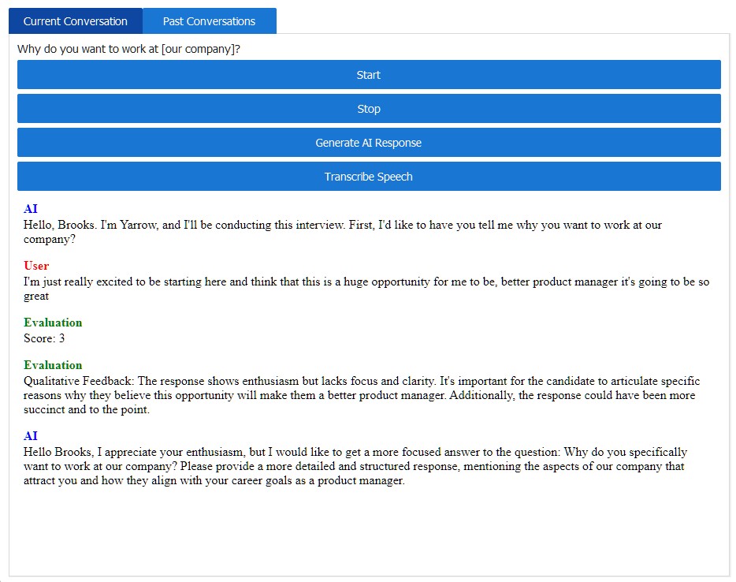

# Welcome To Yarrow
Yarrow is an innovative platform pushing boundaries in negotiation skills and interview preparation. With the backing of advanced AI models, Yarrow provides a distinct environment for conversation simulation, ensuring readiness for real-world interactions. Its design encompasses a rich array of prompts, challenges, and responses, fostering dynamic conversations that evolve with your input.

Yarrow is your personal assistant for role-playing scenarios, from hard-nosed negotiation exercises to critical interview question practice. Interaction with Yarrow leads to learning, adaptation, and response refinement, tailoring dialogue flow for individual pacing and style. This platform exceeds typical correct answer focus, promoting skill enhancement and confidence in communication. Embark on your journey with Yarrow and encounter a superior standard in conversation practice.

 

# Things we're building next
* **Conversation History**: "Let me review all of the questions I've been asked, my answers, and the rating of those answers"
* **Interview performance trends**: "How have my interview performances trended over time based on the AI evaluation?"
* **Custom interivew questions**: "I want to be able to tailor the questions I'm asked to the specific interview I'm practicing for"
* **Interview suites**: "I want to create a set of questions that I want to answer in order so that the practice feels more like a real interview" 


# Setup

### 1. **Clone the repository**
```bash
git clone https://github.com/your_username/Conversational_AI_Assistant.git
cd Conversational_AI_Assistant
```
### 2. **Install the necessary Python packages. It's recommended to do this in a Python virtual environment.**
```bash
pip install -r requirements.txt
``` 
### 3. **You will also need to install some additional software dependencies:**

PortAudio: This is used by PyAudio, which is required to access the microphone. You can install it using the following command:

On Ubuntu 🐧:
```bash
sudo apt-get install portaudio19-dev
```
On macOS 🍎:
```bash
brew install portaudio
```
ffmpeg: This is required for the audio processing. You can install it using the following command:

On Ubuntu 🐧:
```bash
sudo apt-get install ffmpeg
```
On macOS 🍎:
```bash
brew install ffmpeg
```
### 4. **You need to set up your environment variables for the application to work. This includes your Coqui API token, Google Cloud API token, and OpenAI API token.**

Create a .env file in your project directory and add the following lines (replace <YOUR_TOKEN> with your actual tokens):

```bash
COQUI_API_TOKEN=<YOUR_COQUI_API_TOKEN>
GOOGLE_API_TOKEN=<YOUR_GOOGLE_API_TOKEN>
OPENAI_API_TOKEN=<YOUR_OPENAI_API_TOKEN>
```
### 5. **You can now run the assistant:**

```bash
python main.py
```

## Usage
Once you run the assistant, it will prompt you with a message indicating that it's ready to start. The assistant will then provide a situation and personas for the interaction. You will interact with the assistant verbally, and it will respond in kind.

## Things we're building next
* **Conversation History**: "Let me review all of the questions I've been asked, my answers, and the rating of those answers"
* **Interview performance trends**: "How have my interview performances trended over time based on the AI evaluation?"
* **Custom interivew questions**: "I want to be able to tailor the questions I'm asked to the specific interview I'm practicing for"
* **Interview suites**: "I want to create a set of questions that I want to answer in order so that the practice feels more like a real interview" 

